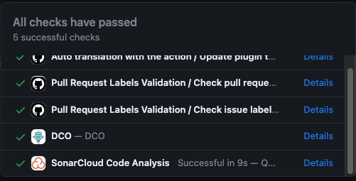

Print maker Lab enforces the Developer Certificate of Origin (DCO) on Pull Requests. It requires all commit messages to contain the Signed-off-by line with an email address that matches the commit author and the name on your GitHub account.

The Developer Certificate of Origin (DCO) is a lightweight way for contributors to certify that they wrote or otherwise have the right to submit the code they are contributing to the project. Here is the full text of the DCO, reformatted for readability ([original version](https://developercertificate.org/)):

> By making a contribution to this project, I certify that:
>
> 1. The contribution was created in whole or in part by me and I have the right to submit it under the open source license indicated in the file; or
>
> 2. The contribution is based upon previous work that, to the best of my knowledge, is covered under an > appropriate open source license and I have the right under that license to submit that work with modifications, whether created in whole or in part by me, under the same open source license (unless I am permitted to submit under a different license), as indicated in the file; or
>
> 3. The contribution was provided directly to me by some other person who certified (a), (b) or (c) and I have not modified it.
>
> 4. I understand and agree that this project and the contribution are public and that a record of the contribution (including all personal information I submit with it, including my sign-off) is maintained indefinitely and may be redistributed consistent with this project or the open source license(s) involved.

Contributors *sign-off* that they adhere to these requirements by adding a Signed-off-by line to commit messages. See [this guide for how to sign-off correctly](./how_to_sign-off_commits.md).

#### DCO Failures

The Print maker Lab project uses a DCO bot for all GitHub pulls to verify that each commit is signed off. When you create your pull request, it will automatically be verified by this bot. An example of what to expect is below.



If your Pull Request fails the DCO check, it's necessary to fix the entire commit history in the PR. Although this is a situation we'd like to avoid the best practice is to squash the commit history to a single commit, append the DCO sign-off as described above or interactively in the rebase comment editing process, and force push. For example, if you have 2 commits in your history (Note the ~2):

```bash
git rebase --interactive HEAD~4
(interactive squash + DCO append)
git push origin --force
```

Note, that in general rewriting history in this way is something that can cause issues with the review process and this should only be done to correct a DCO mistake.