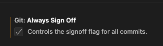
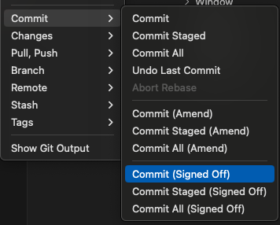

# How to sign-off commits

Print maker Lab requires a sign-off message in the following format appear on each commit in the pull request:

```text
This is my commit message

Signed-off-by: Random J Developer <random@developer.example.org>
```

The text can either be manually added to your commit body, or you can add either `-s` or `--signoff` to your usual git commit commands.

#### Creating your signoff

Git has a `-s | --signoff` command-line option to append this automatically to your commit message:

```bash
git commit --signoff --message 'chore: this is my commit message'
```

```bash
git commit -s -m "chore: this is my commit message"
```

This will use your default git configuration which is found in `.git/config` and usually, it is the `username systemaddress` of the machine which you are using.

To change this, you can use the following commands (Note these only change the current repo settings, you will need to add `--global` for these commands to change the installation default).

Your name:

```bash
git config user.name "FIRST_NAME LAST_NAME"
```

Your email:

```bash
git config user.email "MY_NAME@example.com"
```

#### How to sign-off via Visual Studio Code

You can tell VS Code to append the -s flag to the git commit command, to use signed committing.
Open the settings, search for “sign-off” and check the box “Enables commit signing with GPG”.



Alternatively you can add this line to your settings.json :
```
"git.alwaysSignOff": true
```

Or, you can sign-off each commit manually



#### How to amend a sign-off

If you have authored a commit that is missing the signed-off-by line, you can amend your commits and push them to GitHub

```bash
git commit --amend --signoff
```

If you've pushed your changes to GitHub already you'll need to force push your branch after this with `git push -f`.


#### DCO Failures

If you miss series of commits, you can use the rebase with `-i | --interactive` to edit and append into or use `--signoff` to sign-off commits without rebase
For example, if you have 4 commits in your history (Note the ~4):

```bash
git rebase HEAD~4 --signoff
(interactive squash + DCO append)
git push origin --force
```
